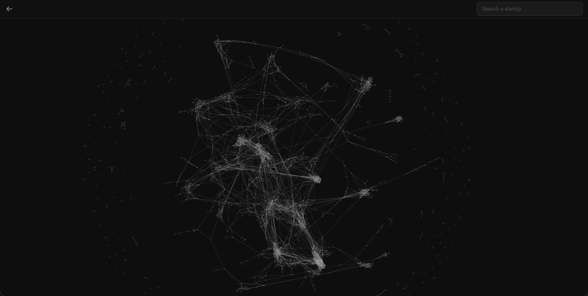
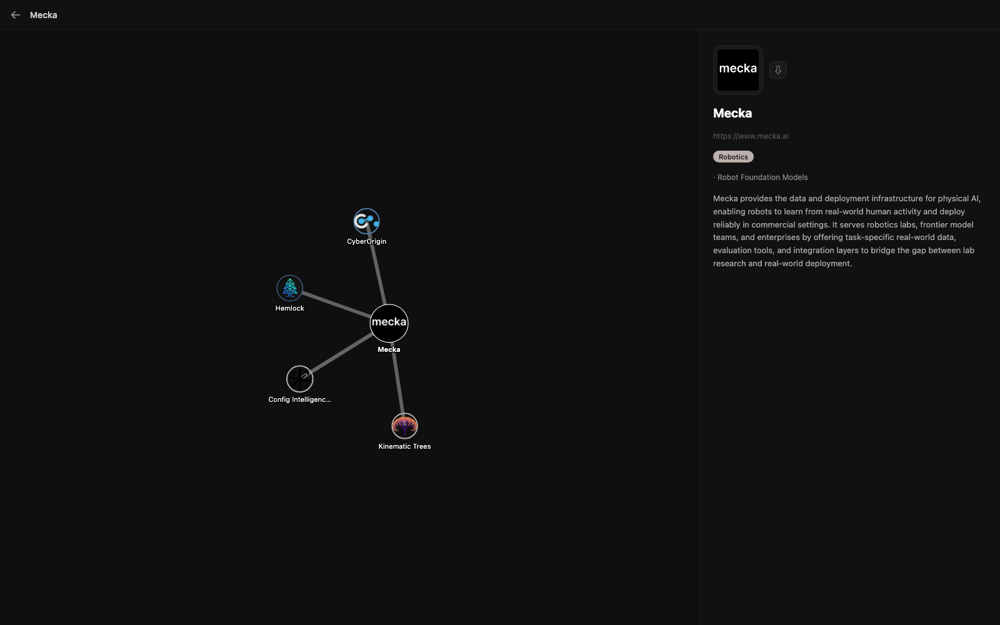

# Startup Intelligence Map

A pipeline that scrapes startup websites, classifies them into a sector/subsector taxonomy with an LLM, and automatically detects competitor relationships, visualized as an interactive graph.

## Screenshots

**Competitor graph**: every startup in the database, linked to its closest competitors:



**Startup detail**: profile, taxonomy, and local competitor neighborhood:



## How it works

1. **Scrape**: `main.py <url>` pulls and cleans the startup's website content
2. **Classify**: a two-step LLM extraction (free-form labels → taxonomy matching) assigns sector / subsector / sub-subsector
3. **Match competitors**: new startups are scored against the existing database and linked bidirectionally
4. **Visualize**: a local web app renders the whole graph and lets you search any startup

Everything is stored in Supabase and browsable through the graph UI.

## Stack

Python · Mistral (LLM extraction) · Supabase (storage) · FastAPI (graph UI) · Playwright / Trafilatura (scraping)

## Running it

```bash
pip install -r requirements.txt
cp .env.example .env   # fill in MISTRAL_API_KEY, SUPABASE_URL, SUPABASE_KEY

python main.py https://startup.com   # add a startup
python graph_app.py                  # launch the graph UI → http://localhost:8000
```

## Key modules

| File | Role |
|---|---|
| `extractor.py` | LLM extraction: free labels → taxonomy matching |
| `taxonomy.py` | 3-level taxonomy: sector → subsector → sub-subsector |
| `competitor.py` | Competitor scoring and relationship saving |
| `storage.py` | Supabase read/write helpers |
| `graph_app.py` | Web app to search startups and visualize the graph |
