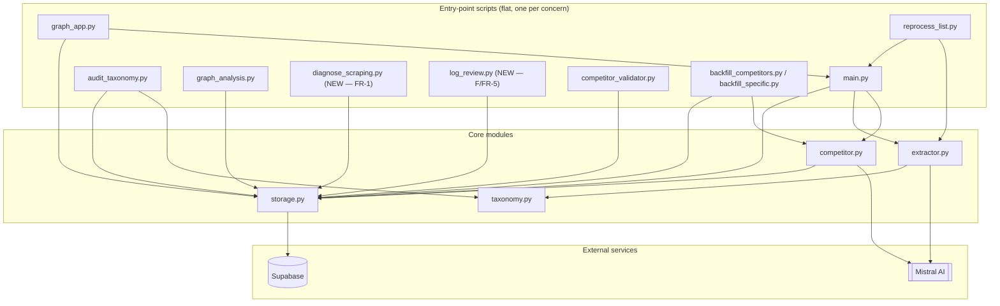

# Architecture Spine — SM Project — Pipeline Stabilization (A/C/B/F)

## Design Paradigm

**Pipeline / shared-core-library**, ratified from existing reality, not invented. Four core modules (`storage.py`, `taxonomy.py`, `extractor.py`, `competitor.py`) implement the scrape → classify → persist → score pipeline; every entry-point script and the FastAPI server import some subset of them rather than duplicating logic. No layered/hexagonal/actor structure, no ORM, no framework beyond FastAPI for the thin API surface. Entry-point scripts stay flat at the repo root — one script per concern, no `src/` nesting.

## Invariants & Rules



### AD-1 — Single point of Supabase access `[ADOPTED]`

- **Binds:** all
- **Prevents:** scattered, divergent Supabase client instantiation across scripts
- **Rule:** every read or write to Supabase goes through `storage.py`; no other module imports `supabase-py` directly.
- **Why:** already the codebase's existing convention — every script imports `storage.py` rather than calling Supabase directly. Ratifying it (rather than exempting the new quality-loop work) keeps one place to reason about the data layer instead of two.

### AD-2 — `quality_review_log` access lives in `storage.py`

- **Binds:** FR-3, FR-5, F
- **Prevents:** a second, divergent path to Supabase dedicated to quality-loop data
- **Rule:** `quality_review_log` reads/writes go only through a new `storage.save_quality_review()` (and a paired getter as needed) — extending AD-1, not exempting F from it. The getter must be queryable by `review_type` and `subject`, because FR-3's Precondition 1 (§4.2 of the PRD) depends on it: before recording a `taxonomy_split` verdict, FR-3's diagnosis checks the log for an existing `scraping_diagnostic` entry on the same site before concluding "structural gap" rather than "scraping artifact." Both review types sharing one queryable table is what makes that guardrail enforceable in practice, not just stated in the PRD.
- **Why:** a dedicated module for quality-loop logic isn't justified yet — it's a single table with a write and a query pattern. Revisit only if F's logic grows substantially beyond that.

### AD-3 — Migration mechanism: Supabase MCP + versioned SQL file, RLS on by default

- **Binds:** FR-5, and any future schema change this initiative introduces (not narrowly `quality_review_log` by name)
- **Prevents:** silent schema drift — the exact failure mode `quality_review_log` exists to correct
- **Rule:**
  - Schema changes are applied via the Supabase MCP `apply_migration` tool (no new local dependency) **and** the executed SQL is saved as a versioned file under `migrations/` in the repo, independent of Supabase's own platform-side history — sequential zero-padded numeric prefix (`001_`, `002_`, ...), one file per migration, numbers never reused.
  - New tables get Row Level Security enabled at creation, matching the existing convention — all 7 current tables (`compspro`, `competitors`, and 5 others) have `rls_enabled: true` (verified live via Supabase MCP on 2026-08-10). `quality_review_log` follows the same default unless a specific reason is found not to.
- **Why:** neither the Supabase CLI (not installed, would add a new tool for one table) nor a hand-rolled migration runner (new tooling with no other user) fit a solo v1. The MCP alone only tracks the change on Supabase's side, not in git — leaving schema changes exactly as untracked as `competitor_validator.py`'s existing raw-SQL RPC pattern, the anti-pattern this table's FR-5 consequence explicitly calls out. This isn't a new discipline for the project either — 7 migrations already exist on this Supabase project (verified live via `list_migrations`), so MCP-applied, tracked schema changes are already this project's real precedent, not a fresh process being imposed. (Separately, why `quality_review_log` is a table at all rather than a file is PRD §4.6's own reason — cross-subsector querying to resolve Scenario A/B — not restated here.) The CLI remains a documented fallback if migration cadence grows.

### AD-4 — `quality_review_log.verdict` is free text, not a DB enum

- **Binds:** FR-1, FR-3, FR-5
- **Prevents:** a hard schema constraint breaking `scraping_diagnostic` entries once that review type starts writing
- **Rule:** `verdict` is a plain `text` column. The 4-value constraint for `review_type = 'taxonomy_split'` (isolated mis-tag / structural gap / scraping artifact / ambiguous, per PRD §4.6) is enforced in application code (`storage.save_quality_review()`), not in the database schema.
- **Why:** taxonomy's fracture-type vocabulary is settled; scraping's failure-type vocabulary (FR-1) is explicitly not — it's still being diagnosed. A DB-level enum would force a premature, cross-review-type vocabulary onto data that isn't ready for one.

### AD-5 — Taxonomy verdicts are decoupled from diagnosis; scraping characterization is not

- **Binds:** FR-1, FR-3, C, F
- **Prevents:** a rushed or informally-reasoned *taxonomy* verdict landing as a byproduct of running an analysis script, instead of following FR-3's reading-rubric precondition (read → assess → decide)
- **Rule:** these two diagnostic paths are deliberately asymmetric, not mirror images of each other:
  - `graph_analysis.py` stays strictly read-only — no writes anywhere. A `taxonomy_split` verdict in `quality_review_log` is written only by `log_review.py` (or any future writer), and only after a human has applied FR-3's reading rubric (Precondition 2) — no code path may write a `taxonomy_split` row without that deliberation step, not just "not from `log_review.py` today."
  - `diagnose_scraping.py` writes its own `scraping_diagnostic` findings to `quality_review_log` directly, as it runs — via `storage.py` (AD-1, AD-2). FR-1's output is automated characterization data (a site is or isn't a known scraping-heterogeneity case), not a deliberated human verdict — there is no reading-rubric-equivalent gate for it to decouple from.
- **Why:** the taxonomy verdict is a considered human judgment call FR-3's own precondition protects; conflating it with an automated read-only script would make deliberation easy to skip. Scraping characterization has no equivalent judgment step to protect, so forcing it through a separate writer script would just be an unjustified extra hop — the asymmetry is intentional, not an inconsistency.

### AD-6 — Threshold recalibration re-scores retroactively

- **Binds:** FR-4
- **Prevents:** silent heterogeneity in the competitor graph — some relationships judged under the old threshold, some under the new one, with no way to tell which is which
- **Rule:** when `COMPETITOR_THRESHOLD` changes, all existing `competitors` rows are re-evaluated against the new threshold, not just future ingests.
- **Why:** verified zero-cost before deciding — `score` is populated on all 3,780 existing rows (`SELECT count(*) FILTER (WHERE score IS NULL), count(*) FROM competitors`, run live against the production Supabase project on 2026-08-10). Nothing forces a partial, silently-inconsistent recalibration.

### AD-7 — `review_type` and `subject` are a defined contract, not free-form

- **Binds:** FR-1, FR-3, FR-5, F
- **Prevents:** two independently-built review types silently drifting on what `subject` means, or a typo'd `review_type` orphaning entries from every query that filters on it
- **Rule:** `review_type` values are a small, fixed vocabulary maintained in application code (`storage.py`), not a DB enum (same reasoning as AD-4) — `save_quality_review()` validates against the known list and rejects or warns on anything else. `subject`'s format is defined per `review_type`: `taxonomy_split` → the exact subsector name (a `TAXONOMY` key); `scraping_diagnostic` → the site's domain. `diagnose_scraping.py` derives its own "have I already characterized this site?" progress by querying `quality_review_log` for existing `scraping_diagnostic` rows on that domain — not a separate local state file — keeping the table the single source of truth AD-1/AD-2 already establish.
- **Why:** found during the reviewer gate's adversarial pass — without a defined `subject` grain per `review_type`, FR-3's Precondition 1 cross-check ("is this a known scraping gap?", AD-2) would silently never match, because the two review types would key on different things without anyone deciding that on purpose.

### AD-8 — Domain normalization is one shared function, not reimplemented per script

- **Binds:** FR-1, FR-3 (specifically Epic 2/Story 2.1 and Epic 3/Story 3.2 of the epic breakdown)
- **Prevents:** two independently-built call sites normalizing a site domain differently (`https://` prefix, `www.` prefix, trailing slash), causing `quality_review_log` lookups to silently miss entries that actually exist
- **Rule:** a single `storage.py` function (e.g. `normalize_domain(url)`) is the only place domain normalization happens — strip scheme, strip leading `www.`, strip trailing slash, lowercase. Both `diagnose_scraping.py` (writing `scraping_diagnostic` subjects) and `log_review.py` (matching a subsector's startup domains against known `scraping_diagnostic` entries) call it; neither reimplements the rule.
- **Why:** found while writing stories, not during the original coaching pass — a textbook case of the spine's own test ("could two units built independently choose incompatibly?"). A silent mismatch here is worse than no guardrail at all: `log_review.py`'s Story 3.2 check would report "no known scraping gap" with false confidence instead of correctly finding one.

## Consistency Conventions

| Concern | Convention |
| --- | --- |
| Naming (entities, files, interfaces, events) | `snake_case` for modules/functions/files; one flat script per concern at repo root, no `src/` nesting; Supabase tables/columns `snake_case` (`compspro`, `competitors`, `quality_review_log`); taxonomy labels are exact-match Title Case strings against `TAXONOMY` dict keys. |
| Data & formats (ids, dates, error shapes, envelopes) | Supabase-generated primary keys; timestamps as Postgres `timestamptz`; every LLM call requests `response_format={"type": "json_object"}`; retries via `tenacity` with exponential backoff on `httpx.TransportError`, `json.JSONDecodeError`, and `SDKError` codes 429/503/529 (existing pattern, extend to new scripts that call the LLM or Supabase). |
| State & cross-cutting (mutation, errors, logging, config, auth) | Config via `.env` + `python-dotenv`, never hardcoded secrets. No structured logging today (`print()`-based) and no auth layer — both `[ADOPTED]` as existing reality and out of this spine's scope (see Deferred). Broad `except Exception` error handling is the existing convention; not changed by this spine's scope (FR-1 through FR-5 only). |

## Stack

| Name | Version |
| --- | --- |
| Python | 3.11.5 |
| FastAPI | 0.136.3 |
| Uvicorn | 0.49.0 |
| supabase-py | 2.30.1 |
| Postgres (Supabase-managed) | 17.6.1.084 |
| mistralai | 2.4.9 |
| Playwright | 1.60.0 |
| playwright-stealth | 2.0.3 |
| networkx | 3.6.1 |
| httpx | 0.28.1 |
| tenacity | 9.1.4 |
| python-dotenv | 1.2.2 |
| html2text | 2025.4.15 |

*Versions confirmed live against the installed `.venv` and the active Supabase project (`umxlmpyxiujyzpkxxkmr`) on 2026-08-10 — not asserted from training data.*

## Structural Seed

```text
SM Project/
  main.py                # existing — scrape/extract/save/score orchestration (ingestion)
  storage.py              # existing — sole Supabase access point (AD-1); gains save_quality_review() (AD-2)
  taxonomy.py              # existing — TAXONOMY tree + cleanup rules
  extractor.py              # existing — LLM classification pipeline
  competitor.py              # existing — competitor scoring; FR-4 recalibration lands here
  graph_analysis.py          # existing — read-only Louvain/betweenness report, stays read-only (AD-5)
  audit_taxonomy.py            # existing — taxonomy coverage audit
  competitor_validator.py        # existing — sampled LLM QA of competitor links
  diagnose_scraping.py           # NEW (FR-1) — read-only scraping-heterogeneity characterization; writes via storage.py
  log_review.py                    # NEW (F/FR-5) — human-in-the-loop verdict capture; writes via storage.py
  migrations/
    001_create_quality_review_log.sql   # NEW (FR-5) — versioned schema record (AD-3)
```

Deployment & environments: no container/CI/environment topology exists or is introduced by this spine — see Deferred.

## Capability → Architecture Map

| Capability / Area | Lives in | Governed by |
| --- | --- | --- |
| FR-1 (scraping diagnosis) | `diagnose_scraping.py` (new) | AD-5, AD-2, AD-4 |
| FR-2 (reduce LLM over-scraping cost) | not built this cycle | Deferred |
| FR-3 (taxonomy fracture queue) | `graph_analysis.py` (existing, read-only) + `log_review.py` (new, writes verdict) | AD-5, AD-2, AD-4 |
| FR-4 (recalibrate competitor threshold) | `competitor.py`, `storage.py` (`COMPETITOR_THRESHOLD`) | AD-6 — *when* FR-4 may start (≥9/11 subsectors diagnosed + no new fracture type in last 3) is PRD §4.3's concrete start trigger, a process gate, not re-derived as an architectural decision here |
| FR-5 (`quality_review_log`) | `migrations/001_create_quality_review_log.sql`, `storage.save_quality_review()` | AD-2, AD-3, AD-4 |

## Deferred

- **Deployment & environments.** No Dockerfile, no CI/CD, no distinct dev/prod environments exist or are introduced here — consistent with the PRD's Non-Goal (§5, not yet multi-user) and the explicit "B reliable ≠ ready for beta" note (PRD §6.1).
- **Auth on `/api/ingest` and the rest of the API.** Currently open to anyone reaching the port; a named prerequisite for beta the PRD deliberately does not start.
- **FR-2 (LLM over-scraping cost).** Deferred post-v1 per the PRD; revisit when multi-user/community scope returns.
- **Rewriting Step 2a/2b extraction logic.** The PRD leaves open whether the fracture pattern is Scenario A (root cause upstream in extraction, correction would be endless) or Scenario B (isolated, heterogeneous cases, a finite catch-up) — this spine doesn't decide between them and defers action under *either* reading. Only FR-3's diagnosis (logging fracture type per subsector) is in scope; the fix implied by Scenario A specifically is not.
- **Features D, E, G** (Search & Consultation, Global Graph View, Logos) — keep operating as-is; no architectural change in this spine's scope.
- **Supabase CLI migrations** — a heavier, more standard option than AD-3's hybrid approach; revisit if migration cadence grows beyond this single table.
- **Structured logging / replacing broad `except Exception`.** Flagged by a prior adversarial code review as a real weakness, but out of this spine's bound scope (FR-1 through FR-5 only) — not silently forgotten, just not this cycle's job.
- **Test suite.** None exists for this codebase today (per the prior brownfield review); FR-1 through FR-5's implementation doesn't introduce one — consistent with existing project convention, not addressed by this spine.
- **Dependency version risk, flagged for implementers, not re-decided here** (found during the reviewer gate's version-verification pass): `networkx` 3.6.x has had real deprecation/rename churn — worth a quick check that `graph_analysis.py`'s Louvain/betweenness calls are unaffected before FR-1/FR-3 work leans on it. `playwright-stealth` 2.x replaced 1.x's `stealth_async(page)` with a context-manager API — a breaking change relevant if FR-1's scraping-diagnostic work touches `main.py`'s scrape path. `mistralai`'s `SDKError`/status-code retry pattern (Consistency Conventions) is real for recent SDK versions but wasn't confirmed to hold specifically at the pinned 2.4.9.
